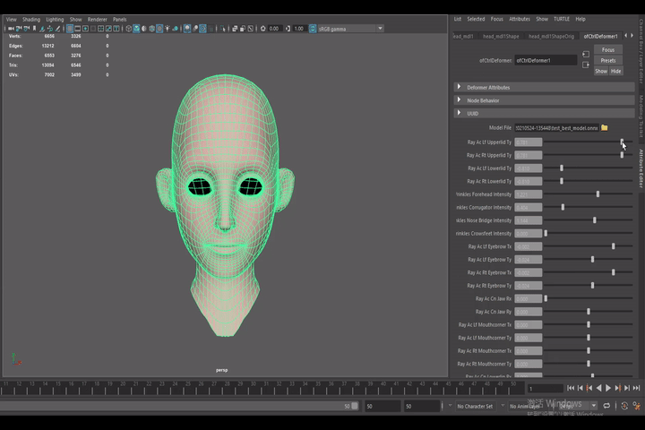

# machine-learning-facial-deformer
This repo is used to map Controller value to Mesh Vertex by using Artificial Neural Network.

<div align=center></div>

## Prerequisites
> * Maya [2018.6] [Cut ID:201903222215-65bada0e52]
> * Python 3.6
> * Numpy in Maya

## How to use it
Character rig file [Ray](https://www.cgtarian.com/maya-character-rigs/download-free-3d-character-ray.html) is used to demonstrate my code, you can use the modified one from [google cloud](https://drive.google.com/file/d/1DuBFxXbvfaKBhhJHx0MpdswHszDL27Lz/view?usp=sharing), the modification lies in that I split the head and body. Thanks for [CGTarian](https://www.cgtarian.com/) for developing and releasing the character rig.

1. Training data generation
> * generate frames
```python in Maya
import sys
sys.path.append("/full/path/to/top/level/of/this/repository")
import os
os.chdir("/full/path/to/top/level/of/this/repository")
import script.generate_frame as gf
gf.main(controller_file_path="/full/path/to/your/controller/file", frame_num=num_of_frames)
```
> * save controller value and mesh vertex to file

it's recommended that you arrange your data folder like this
```
data
│
└───csv
│
└───ctrl
│
└───mesh
│   
└───pca
```
```python in Maya
import maya.cmds as cmds
cmds.loadPlugin("/full/path/to/top/level/of/this/repository" + "/scripts/Ctrl2MeshCmd.py")

# save neutral head
cmds.Ctrl2MeshCmd(controllerFileFlag="/full/path/to/your/controller/file", controllerpathFlag="/full/path/to/your/controller/save/folder", meshFlag="head_mdl", meshpathFlag="/full/path/to/your/mesh/save/folder", endFlag=0)

# save controller value and mesh displacement
cmds.Ctrl2MeshCmd(controllerFileFlag="/full/path/to/your/controller/file", controllerpathFlag="/full/path/to/your/controller/save/folder", meshFlag="head_mdl", meshpathFlag="/full/path/to/your/mesh/save/folder", neutralpathFlag="/full/path/to/your/neutral/head/file")
```
2. Training csv generation
```python on host machine
python script/generate_csv.py "/full/path/to/your/data/folder" "/full/path/to/your/csv/folder"
```
3. PCA
```python on host machine
python bin/pca.py "/full/path/to/your/training/csv/file" num_of_pca_components
```
4. Training
```python on host machine
python bin/train.py config/example.yaml "/full/path/to/your/training/save/folder" --num_workers=4 --device_ids=0
```
5. Testing
> * python tester.py -h, eg:
```python on host machine
python bin/test.py "/full/path/to/your/training/save/ckpt" "/full/path/to/your/training/config/file" "/full/path/to/your/test/csv/file"
```

## References
> * [fast-n-deep-faces](https://github.com/stephen-w-bailey/fast-n-deep-faces)
```bibtex
@article{Bailey:2020:FDF,
  note = {Presented at SIGGRAPH 2020, Washington D.C.},
  doi = {10.1145/3386569.3392397},
  title = {Fast and Deep Facial Deformations},
  journal = {ACM Transactions on Graphics},
  author = {Stephen W. Bailey and Dalton Omens and Paul Dilorenzo and James F. O'Brien},
  number = 4,
  month = aug,
  volume = 39,
  year = 2020,
  pages = {94:1--15},
  url = {http://graphics.berkeley.edu/papers/Bailey-FDF-2020-07/},
}
```

> * FaceBaker
```bibtex
@inproceedings{inproceedings,
author = {Radzihovsky, Sarah and Goes, Fernando and Meyer, Mark},
year = {2020},
month = {08},
pages = {1-2},
title = {FaceBaker: Baking Character Facial Rigs with Machine Learning},
doi = {10.1145/3388767.3407340}
}
```